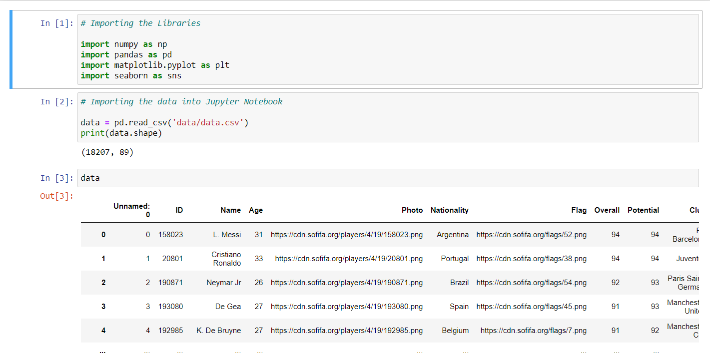
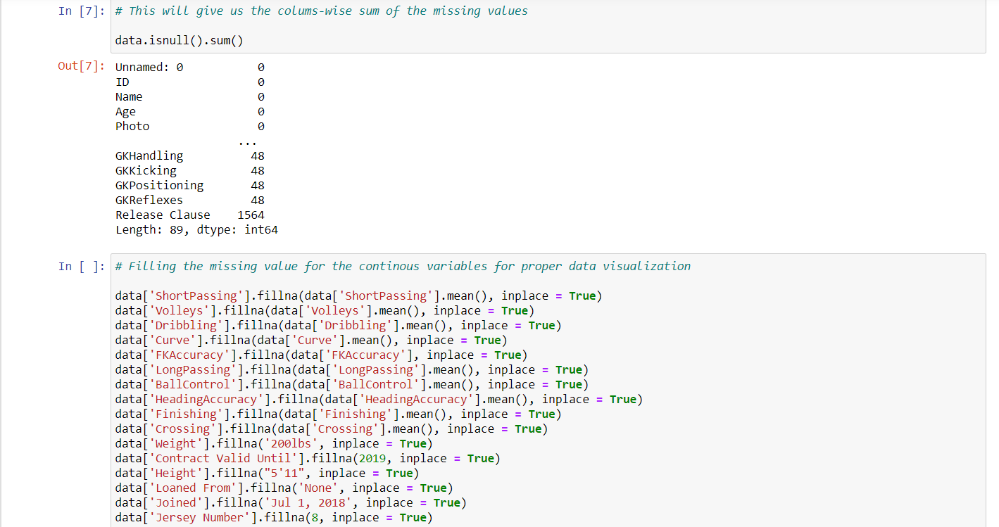
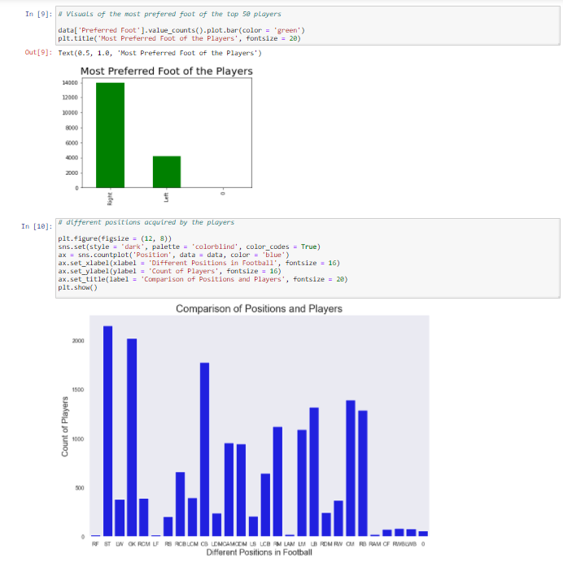
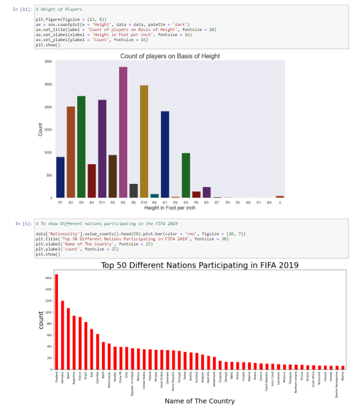
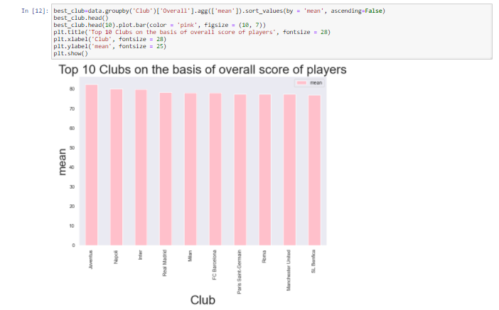

# Description

* Performed Exploratory Data Analysis on Fifa-19 Dataset. 
* Plotted graphs to find the 
  1.  Preferred foot
  2.  Different positions of players
  3.  Common height in football  
  4.  Top 50 different nations participating. 
  5.  Top 10 clubs based on overall scores of players.
* It was found that 
  * Right foot was used more than left foot.
  * Standing Tackle(ST) was the most popular position during the season
  * Highest number of players have their heights in between 5’9 to 6’1.
  * England is the top-most country whose players participate in the FIFA world cup season, followed by Germany, Spain and Argentina
  * Juventus is the top-most club followed by Napoli and Inter. 

# Running the Notebook
1. Clone the repository.
2. Open the notebook in Anaconda environment
3. Run all the cells.

# Tools
* Python Distribution - Anaconda
* Notebook Envireonment - Jupyter Notebook
* Programming Language - Python
* Libraries - Numpy, Pandas, Seaborn, Matplotlib

# Screen Captures

* Following are screen captures.

